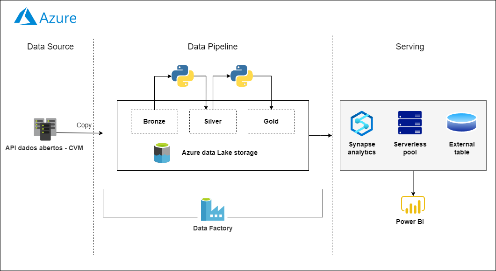
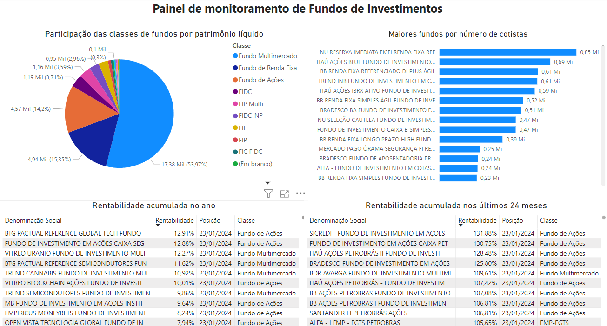

## Overview

Here you want to write a short overview of the goals of your project and how it works at a high level. If possible, include one or two images of the end product and architecture diagram (see examples below). diagrams.net is a great tool for creating architecture diagrams.

### Data Ingestion
Data on daily shares of Brazilian investment funds are hosted in an http server that can be found on the <a href = "https://dados.cvm.gov.br/dataset/fi-doc-inf_diario"> CVM's open data portal </a>. The files for the years between 2000 and 2020 are available in zip format and contain information aggregated by year, and are not subject to the update policy. The other files will also be made available in zip format, however, the records will be grouped by month.The files for the current (M) and previous (M-1) months will be updated daily with any resubmissions. The update takes place from Monday to Saturday, at 8:00 am, with data received by CVMWeb until 11:59 pm the previous day. The files relating to months M-2, M-3, ..., up to M-11 will be updated weekly with any resubmissions, in case they exist. So every month a new file is uploaded to CVM's open data portal, representing that the source has a dynamic behaviour in the http server, for which the azure data factory doesn't seems to be the best tool to handle it.   

The initial solution implemented for that situation was a python script running inside a databricks notebook, which takes all the links tags and the respective update file information from the source page. The script writes this information in a csv file uploaded in the data lake, for later azure data factory lookup activity, in order to parse all that data and delivery it to the copy activity. Despite this was a valid solution for the problem, it seems to be unnecessarily costly, as the databricks notebook uses a cluster os distributed machines to process large dataset with spark, which is not the case in this stage of the project.

### Data Architecture

If you decide to include this, you should also talk a bit about why you chose the architecture and tools you did for this project.

### Data Visualization

## Prerequisites

Directions or anything needed before running the project.

- Prerequisite 1
- Prerequisite 2
- Prerequisite 3

## How to Run This Project

Replace the example step-by-step instructions with your own.

1. Install x packages
2. Run command: `python x`
3. Make sure it's running properly by checking z
4. To clean up at the end, run script: `python cleanup.py`

## Lessons Learned

It's good to reflect on what you learned throughout the process of building this project. Here you might discuss what you would have done differently if you had more time/money/data. Did you end up choosing the right tools or would you try something else next time?

## Contact

Please feel free to contact me if you have any questions at: LinkedIn, Twitter

