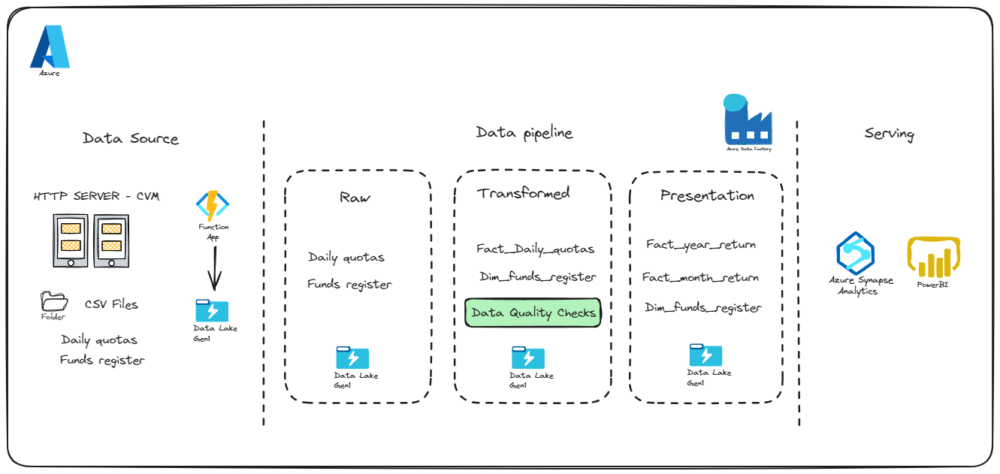
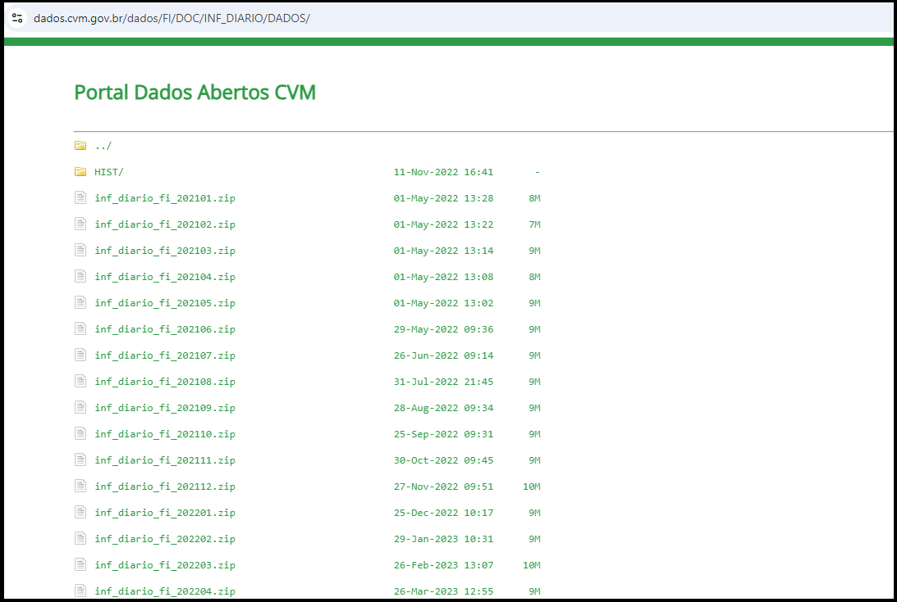
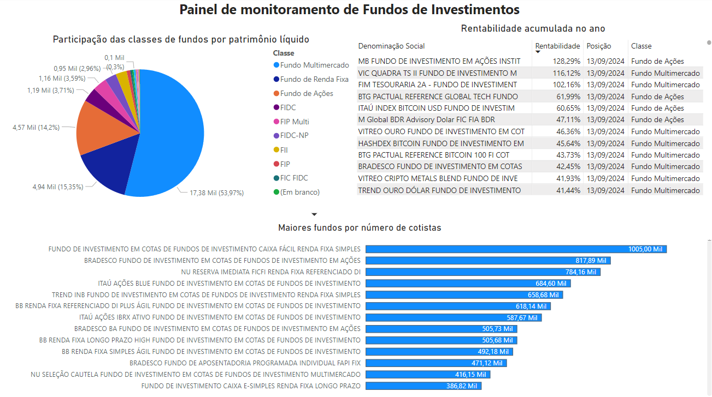

## Overview

The objective of this project is to create a scalable data environment, with information ingested from the CVM (Securities Commission) API that allows the development of a dashboard that provides the return of investment funds based on the type of funds and specific time windows. The goal is to screening new investment funds for further development or recommendation to clients of an investiment bank company.This project will be executed with tools only provided by Azure cloud, such as Azure Functions, Azure Data Factory, Azure Data Flow, Azure Synapse Analytics, and Power BI.

### Data Architecture

### Dataset

Data on daily shares of Brazilian investment funds are hosted in an HTTP Server that can be found on the <a href = "https://dados.cvm.gov.br/dataset/fi-doc-inf_diario"> CVM's open data portal </a>. The files for the years between 2000 and 2020 are available in zip format and contain information aggregated by year, and are not subject to the update policy. From the year 2021 onwards, the records will be grouped by month.The files for the current (M) and previous (M-1) months will be updated daily with any resubmissions. The update takes place from Monday to Saturday, at 8:00 am, with data received by CVMWeb until 11:59 pm the previous day. The files relating to months M-2, M-3, ..., up to M-11 will be updated weekly with any resubmissions, in case they exist. So every month a new file is uploaded to CVM's open data portal, representing that the source has a dynamic behaviour in the http server, for which the azure data factory doesn't seems to be the best tool to handle it. Below we have an example of data columns and types for the daily quotes dataset.

### Data Ingestion

 Considering the specific needs for this project, in terms of generation of dynamic http links to download the files, which azure copy activity doesen't seem to fit well, i choose to parse the html main address with the python library beatifulsoup to take all the links of the files, as showed below. After that, i inserted this links in an csv files and save it to the data lake, for Azure Data Factory lookup activity. The initial solution implemented for that situation was a python script running inside a databricks notebook, however, despite it's a valid solution for the problem, it seems to be unnecessarily costly, as the databricks notebook uses a cluster of distributed machines to process large datasets with spark, which is not the case in this stage of the project. After that, I implemented an Azure Function solution, which is a more lightweight and cheaper solution for this problem, once it runs serverless python scripts and has a monthly free grant of 250,000 executions per subscription in pay-as-you-go.

 Once we don't know when and if monthly data will be updated, specially for the older data, I choosed to implement an incremental ingestion pattern, in order to reduce data movement costs. To do so, I created an If Condition activity from Azure Data Factory with a logical sentence that needs to satisfy one of two conditions to bring the data from the HTTP server: (1) The monthly file doesen't exists in the data lake, indicating that we are in the beginning of the month, or (2) the source update data is greater than the last modifyed data for the same file in the data lake.

### Data Pipeline

#### Raw
#### Transformed
#### Data Quality
#### Presentation

The data transformation process was performed with the utilization of Data flow tool, which uses a spark cluster as the processing engine. The main transformations used were Cast, Window (To drop duplicates), Assert (For Data Quality checks) and derived column.

### Data Visualization

